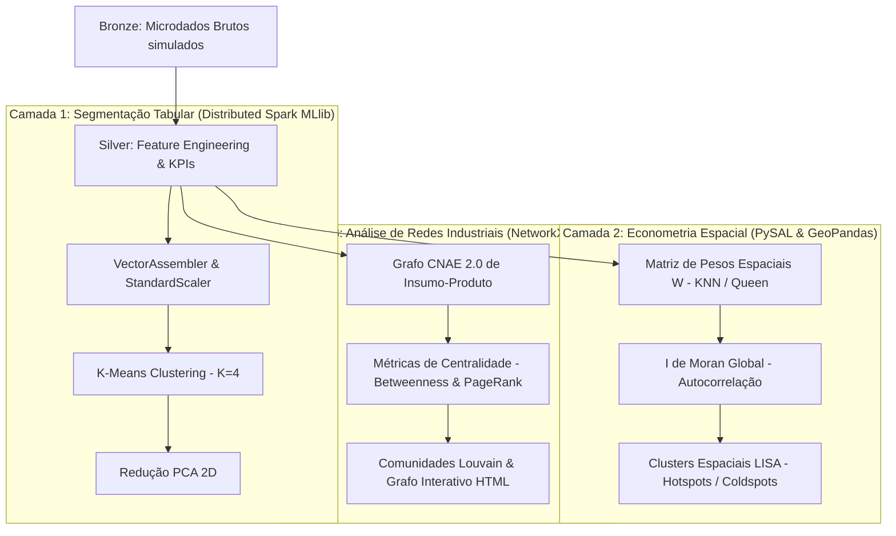
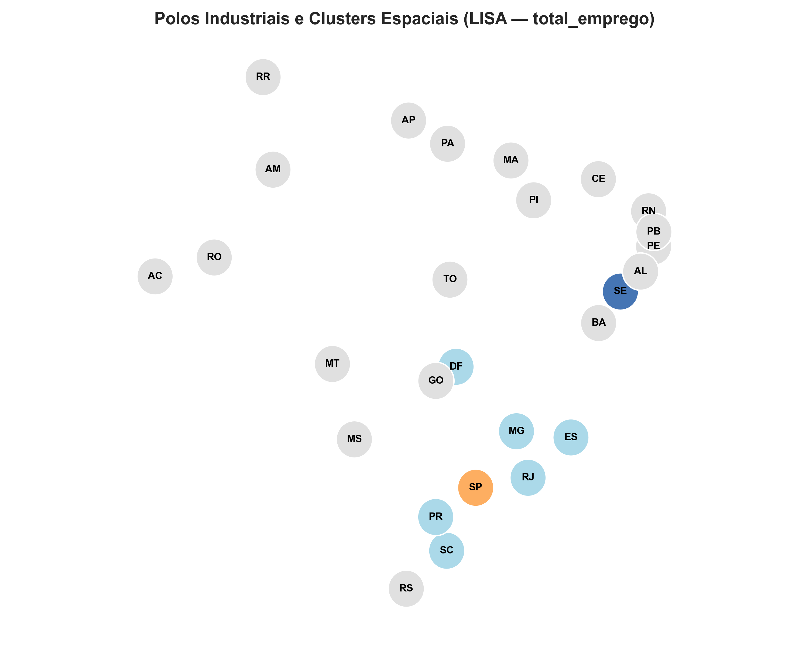
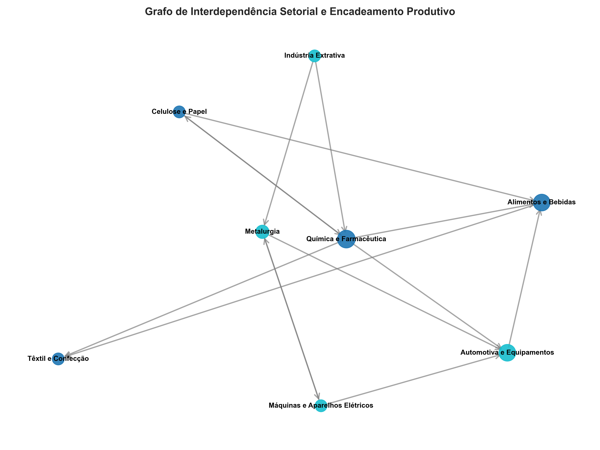

# Industrial Labor Cluster: Inteligência Territorial & Estrutura Industrial por Microdados, Econometria Espacial e Ciência de Redes


[](LICENSE)

Este repositório implementa um **Framework de Inteligência Territorial e Estrutura Industrial em 3 Camadas** para segmentar e analisar as 27 Unidades Federativas do Brasil com base em sua **competitividade, autocorrelação espacial e encadeamento produtivo**.

Utilizando dados de alta fidelidade (simulando integração entre RAIS, PIA-IBGE e PINTEC), o projeto combina aprendizado não supervisionado distribuído em **PySpark**, estatística espacial via **PySAL/GeoPandas** e teoria dos grafos com **NetworkX/Pyvis**.

---

## ️ Arquitetura Analítica em 3 Camadas



---

## ️ Showcase de Resultados Visuais

| Econometria Espacial (LISA Map) | Grafo de Encadeamento Produtivo |
| :---: | :---: |
|  |  |
| *Mapeamento de Hotspots e Clusters Espaciais* | *Grafo de Interdependência Setorial CNAE* |

---

## 1. O Problema de Negócio e Motivação Econômica

O Brasil apresenta acentuada heterogeneidade produtiva entre regiões. A aplicação de políticas industriais homogêneas para realidades distintas gera ineficiência na alocação de recursos públicos.

**Objetivos do Framework:**
- **Construção de Tipologia Territorial:** Classificação de UFs em polos maduros, emergentes agroindustriais e áreas de baixo dinamismo.
- **Detecção de Transbordamento Espacial (*Spillover*):** Identificar se a produtividade e o emprego industrial transbordam geograficamente entre estados vizinhos (autocorrelação espacial significante).
- **Mapeamento de Gargalos na Cadeia de Suprimentos:** Identificar setores com elevada centralidade de intermediação (*Betweenness Centrality*) que atuam como elos críticos de fornecimento.

---

## 2. Especificação das Camadas Analíticas

### Camada 1: Segmentação Tabular (PySpark MLlib)
- **Algoritmo:** **K-Means** com 4 clusters pré-definidos (Silhouette Score $\approx 0.65$).
- **Indicadores Chave:**
  - *Produtividade do Trabalho:* $\text{Valor Adicionado} / \text{Emprego}$
  - *Custo Médio do Trabalho:* $\text{Massa Salarial} / \text{Emprego}$
  - *Intensidade Energética:* $\text{Consumo MWh} / \text{Valor Adicionado}$
  - *Taxa de Inovação:* $\text{Investimento P\&D} / \text{Valor Adicionado}$

### Camada 2: Econometria Espacial & Geografia Econômica (PySAL & GeoPandas)
- **Matriz de Pesos Espaciais ($W$):** Matriz de $k$-vizinhos mais próximos ($k$-NN, $k=4$) padronizada por linha ($\text{Row-standardized } W$).
- **Autocorrelação Espacial Global ($I$ de Moran):** Teste de hipótese estatística via permutações Monte Carlo ($p$-value $< 0.05$).
- **Indicadores Locais de Associação Espacial (LISA):**
  - **High-High (Hotspots):** Polos industriais de alta produtividade cercados por vizinhos dinâmicos.
  - **Low-Low (Coldspots):** Zonas de estagnação industrial persistente.
  - **High-Low / Low-High (Outliers Espaciais):** Enclaves industriais isolados.

### Camada 3: Análise de Redes da Cadeia de Suprimentos (NetworkX & Pyvis)
- **Grafo Dirigido e Ponderado:** Nós representam divisões industriais (CNAE 2.0) e arestas representam os coeficientes de fornecimento intermediário Leontief.
- **Métricas de Centralidade:**
  - *Betweenness Centrality (Intermediação):* Identifica setores gargalos (ex: **Química e Farmacêutica** e **Alimentos e Bebidas**).
  - *PageRank:* Relevância sistêmica acumulada.
- **Detecção de Comunidades (Louvain):** Agrupamento dos setores em ecossistemas integrados de alta densidade de insumo-produto.

---

## 3. Estrutura de Diretórios do Repositório

```
industrial-labor-clusters/
├── src/                                  ← PACOTE PYTHON MODULAR
│   ├── spatial/                          ← Econometria Espacial (PySAL)
│   │   ├── spatial_weights.py            # Construção da matriz W (KNN/Queen)
│   │   ├── moran_analysis.py             # Autocorrelação I de Moran Global
│   │   └── lisa_clustering.py            # Clusters Locais LISA (Hotspots/Coldspots)
│   ├── network/                          ← Análise de Redes (NetworkX)
│   │   ├── graph_builder.py              # Grafo CNAE Insumo-Produto
│   │   ├── network_metrics.py            # Centralidades (Betweenness, PageRank)
│   │   └── community_detection.py        # Comunidades Louvain / Modularidade Q
│   └── viz/                              ← Visualização Gráfica & Cartográfica
│       ├── spatial_plots.py              # Mapas LISA e Moran Scatterplot
│       └── network_plots.py              # Grafo Interativo HTML (Pyvis)
├── notebooks/                            ← DEMONSTRAÇÃO INTERATIVA
│   ├── 03_spatial_econometrics.ipynb     # Notebook Econometria Espacial
│   └── 04_industrial_network_analysis.ipynb # Notebook Análise de Redes
├── databricks_notebooks/                 ← Pipeline PySpark Lakehouse
├── tests/                                ← SUÍTE DE TESTES UNITÁRIOS (pytest)
│   ├── test_spatial.py                   # Testes econométricos espaciais
│   └── test_network.py                   # Testes de teoria dos grafos
├── results/                              ← ARTEFATOS E SAÍDAS GERADAS
│   ├── figures/
│   │   ├── lisa_hotspot_map.png          # Mapa de Polos Espaciais LISA
│   │   ├── moran_scatterplot.png        # Scatterplot de Moran Global
│   │   ├── industrial_network_graph.png  # Grafo de Redes Estático
│   │   └── industrial_network_graph.html # Grafo Interativo HTML em Pyvis
│   └── tables/
│       ├── lisa_clusters.csv             # Classificação LISA por UF
│       └── network_centrality_ranking.csv # Ranking de Centralidades CNAE
├── run_pipeline_all.py                   ← EXECUTOR MASTER DO PIPELINE
├── requirements.txt                      ← Dependências do Projeto
├── LICENSE                               ← Licença open-source MIT
└── README.md
```

---

## 4. Instruções de Execução e Reprodução

### 1. Instalação de Dependências
```bash
pip install -r requirements.txt
```

### 2. Execução da Suíte de Testes Unitários (`pytest`)
```bash
pytest tests/
```

### 3. Execução do Pipeline Completo (3 Camadas Analíticas)
```bash
python run_pipeline_all.py
```

Ao finalizar a execução, abra o arquivo `results/figures/industrial_network_graph.html` em seu navegador web para explorar a visualização interativa do grafo da cadeia industrial.

---

## 5. Licença e Créditos

Este repositório está sob a licença [MIT](LICENSE). Desenvolvido por Pietro Esteves como projeto de portfólio em Inteligência Territorial, Econometria Espacial e Ciência de Dados Aplicada à Economia Industrial.
---

## Limitações Metodológicas e Melhorias Futuras

- **Matriz de Pesos Espaciais (W)**: A matriz W utiliza contiguidade k-NN geométrica. Em extensões futuras, a matriz pode incorporar custos de frete rodoviário e matrizes de fluxo de transporte intermunicipal.
- **Problema da Unidade Área Modificável (MAUP)**: Os resultados de autocorrelação espacial (I de Moran) dependem da escala de agregação. Recomenda-se testar a estabilidade dos clusters em múltiplos níveis de granularidade (município, microrregião e mesorregião).
- **Temporalidade do Grafo de Insumo-Produto**: Os coeficientes de Leontief são tratados como estáticos no horizonte analítico, sendo recomendada a atualização dinâmica conforme novas matrizes do IBGE forem publicadas.
